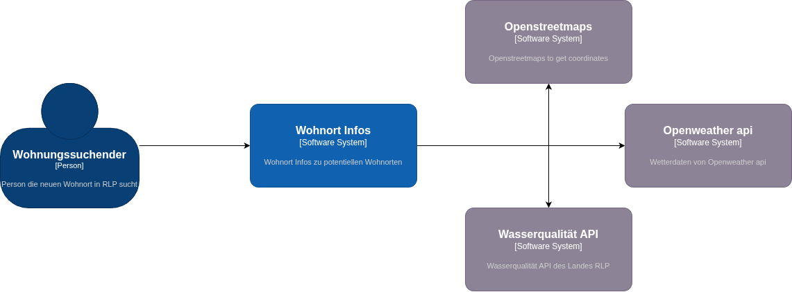
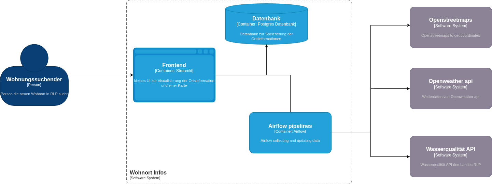

# Location Info

## Project Description
Ich möchte möglichst viele Informationen zu einem Ort in Deutschland (Rheinland Pfalz) sammeln und darstellen.
Ziel ist eine Einschätzung ob man dort wohnen möchte. 

## Teammitglieder
- Denis Morath

## Status

### Branch to grade
**main**

### Status
**In Bearbeitung**

## C4 Diagramme
### Context Diagramm

### Container Diagramm

## Devcontainer Konfiguration
Es gibt eine Devcontainer config für airflow, eine für das backend und eine für das frontend. Durch öffnen der unterordner kann die Entwicklungsumgebung für die entsprechende Komponente gestartet werden. 
Im obersten Ordner liegt eine docker compose file um alle Komponenten in docker zu starten.

## Kubernetes Deployment Manifest
Link zum Kubernetes Deployment Manifest im Repository.

## Image Liste
- Image 1: Beschreibung, Link zum Dockerfile im Repository
- Image 2: Beschreibung, Link zum Dockerfile im Repository
- ...

## Tests
- Test: Beschreibung, Link zum Testcode im Repository
